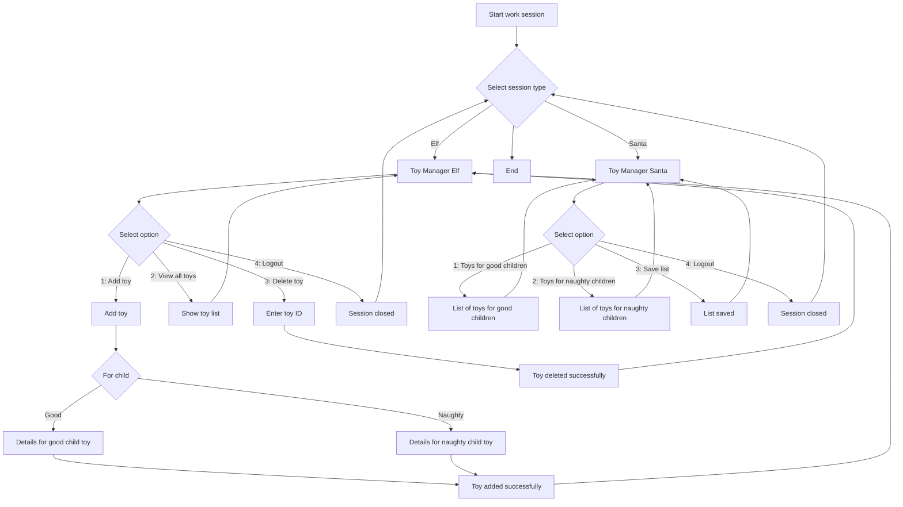

# Project - Santa Claus Toy Factory

# Instrucciones
OH! OH! OH! Santa Claus necesita tu ayuda developer!!! Para estas navidades Santa a decidido renovar su sistema de gestión de juguetes y dejar de lado la creación manual de largos pergaminos. Pero OJO! el sistema se comportará de manera distinta dependiendo de si lo usa Santa o uno de sus elfos y el sistema de almacenamiento de los datos va ser distinto en función de si el juguete es para niños buenos o si es un juguete para niños malos.

Se os ha encargado la creación de una aplicación de consola que permitirá a los elfos de Santa registar los juguetes creados, listar el inventario y suprimir juguetes.

Si la aplicación es utilizada por Santa entonces podrá obtener la lista de juguetes para niños buenos o la lista de juguetes para niños malos. También deberá tener la posibilidad de guardar la lista completa de todos los juguetes en formato .csv.

# Objetivo
Acercarnos poco a poco la arquitectura clásica de Spring Boot. Aplicar el patrón de arquitectura MVC (Model-View-Controller) para estructurar la aplicación. Entender y aplicar el patrón repositorio y la inversión de dependencias.

# Historias de usuario
1. COMO Elfo QUIERO añadir un juguete para niño bueno al inventario proporcionando el título, marca, franja de edad recomendada y categoria PARA su almacenamiento 

2. COMO Elfo QUIERO añadir un juguete para niño malo al inventario proporcionando el título y su contenido PARA su almacenamiento.

2. COMO Elfo QUIERO ver el listado de todos los juguetes PARA un control del inventario

3. COMO Elfo QUIERO suprimir un juguete PARA evitar tener juguetes defectusos en el inventario

4. COMO Elfo QUIERO salir de la sesión PARA finalizar mi jornada de trabajo.

5. COMO Santa QUIERO ver la lista de juguetes para niños buenos PARA comprobación de inventario

6. COMO Santa QUIERO ver la lista de juguetes para niños malos PARA comprobación de inventario

7. COMO Santa Quiero guardar en formato csv la lista de todos los juguetes PARA comprobación de datos mediante aplicación externa

8. COMO Santa Quiero salir de la sesión PARA finalizar mi jornada de trabajo.

Por cada historia de usuario se deberán redactar los criterios de aceptación.

# Ejemplo de interacción con la consola
Casos de uso para Elfos:

```
Iniciar sesión de trabajo como:
1. Elfo
2. Santa Claus
Seleccione una opción: 1
-----------
Gestor de juguetes (Tipo de sesión: Elfo)
1. Añadir juguete
2. Ver todos los juguetes
3. Eliminar juguete
4. Cerrar sesión
Seleccione una opción: 1
-----------
Para niño ...:
1. Bueno
2. Malo
Seleccione una opción: 1

Ingrese el título: LEGO Star Wars - Halcón Milenario - 75375
Ingrese la marca: LEGO
Ingrese la edad recomendada: +18
Ingrese la categoria: Juguetes de Construcción
Juguete añadido con éxito
-----------
Gestor de juguetes (Tipo de sesión: Elfo)
1. Añadir juguete
2. Ver todos los juguetes
3. Eliminar juguete
4. Cerrar sesión
Seleccione una opción: 1
-----------
Para niño ...:
1. Bueno
2. Malo
Seleccione una opción: 2

Ingrese el título: Mystery Box 5x5
Ingrese la contenido: Carbón
Juguete añadido con éxito
-----------
Gestor de juguetes (Tipo de sesión: Elfo)
1. Añadir juguete
2. Ver todos los juguetes
3. Eliminar juguete
4. Cerrar sesión
Seleccione una opción: 2

Lista de juguetes:
B1. Título: LEGO Star Wars - Halcón Milenario - 75375, Marca: LEGO, Edad Recomendada: +18, Categoria: Juguetes de Construcción
M1. Título: Mystery Box 5x5, Contenido: Carbón
-----------
Gestor de juguetes (Tipo de sesión: Elfo)
1. Añadir juguete
2. Ver todos los juguetes
3. Eliminar juguete
4. Cerrar sesión
Seleccione una opción: 3

Ingrese el identificador del juguete a eliminar: B1
Juguete eliminado con éxito
-----------
Gestor de juguetes (Tipo de sesión: Elfo)
1. Añadir juguete
2. Ver todos los juguetes
3. Eliminar juguete
4. Cerrar sesión
Seleccione una opción: 4

Sesión cerrada correctamente.
```

Casos de uso para Santa Claus:
```
Iniciar sesión de trabajo como:
1. Elfo
2. Santa Claus
Seleccione una opción: 2
-----------
Gestor de juguetes (Tipo de sesión: Santa)
1. Ver lista de juguetes niños buenos
2. Ver lista de juguetes niños malos
3. Guargar lista de todos los juguetes (.csv)
4. Cerrar sesión
Seleccione una opción: 1

B1. Título: LEGO Star Wars - Halcón Milenario - 75375, Marca: LEGO, Edad Recomendada: +18, Categoria: Juguetes de Construcción
B2. Título: LEGO City - Exploradores del Ártico: Barco - 60368
, Marca: LEGO, Edad Recomendada: 5-7, Categoria: Juguetes de Construcción
-----------
Gestor de juguetes (Tipo de sesión: Santa)
1. Ver lista de juguetes niños buenos
2. Ver lista de juguetes niños malos
3. Guargar lista de todos los juguetes (.csv)
4. Cerrar sesión
Seleccione una opción: 3

Lista de juguetes guardada.
-----------
Gestor de juguetes (Tipo de sesión: Santa)
1. Ver lista de juguetes niños buenos
2. Ver lista de juguetes niños malos
3. Guargar lista de todos los juguetes (.csv)
4. Cerrar sesión
Seleccione una opción: 4

Sesión cerrada correctamente.
```

# 🏁 Rúbrica de evaluación
- <strong>Interfaz de usuario</strong>
    - La interfaz permite a los elfos añadir juguetes (5%)
    - La interfaz permite a los elfos visualizar todos los juguetes (5%)
    - La interfaz permite a los elfos eliminar un juguete (5%)
    - La interfaz permite cerrar sesión (5%)
    - La interfaz permite a Santa ver la lista de juguetes para niños buenos (2.5%)
    - La interfaz permite a Santa ver la lista de juguetes para niños malos (2.5%)
    - La interfaz permite a Santa guardar la lista de juguetes en un archivo .csv (5%)

- <strong>Persistencia de datos</strong>
    - Persistencia de datos en memoria
    - Implementación del patrón repository (20%)

- <strong>Código y Buenas Prácticas</strong>
    - Tests de cobertura mínimo un 70% (20%)
    - El código está bien estructurado (10%)
    - Implementación de la arquitectura MVC (20%)


--------

English  version

# Project - Santa Claus Toy Factory

# Instructions
OH! OH! OH! Santa Claus needs your help developer!!! For this Christmas Santa has decided to renew his toy management system and stop manually creating long scrolls. But BE CAREFUL! The system will behave differently depending on whether it is used by Santa or one of his elves and the data storage system will be different depending on whether the toy is for good children or if it is a toy for bad children.
You have been tasked with creating a console application that will allow Santa's elves to log created toys, list inventory, and delete toys.
If the app is used by Santa then he will be able to get the list of toys for good children or the list of toys for bad children. He should also have the ability to save the complete list of all toys in .csv format.

# To do
Slowly approach the classic Spring Boot architecture. Apply the MVC (Model-View-Controller) architecture pattern to structure the application. Understand and apply the repository pattern and dependency inversion.

# User Stories
1.	AS AN Elf I WANT TO add a good boy's toy to the inventory by providing the title, brand, recommended age range and category FOR storage
2.	AS an Elf I WANT to add a naughty boy toy to the inventory by providing the title and its contents FOR storage.
3.	AS an Elf I WANT to see the list of all the toys FOR inventory control
4.	AS an Elf I WANT to delete a toy to avoid having defective toys in the inventory
5.	AS AN Elf I WANT TO log out TO finish my work day.
6.	AS Santa I WANT TO SEE THE LIST OF GOOD TOYS FOR KIDS FOR CHECK INVENTORY
7.	AS Santa I WANT TO SEE THE CHILDREN'S Naughty TOY LIST FOR INVENTORY CHECK
8.	AS Santa I want to save the list of all toys in csv format FOR data verification using external application
9.	LIKE Santa I want to log out TO finish my work day.

Acceptance criteria must be written for each user story.


# 🏁 Evaluation rubric
•	User Interface
 -	The interface allows elves to add toys (5%)
 -	The interface allows the elves to view all the toys (5%)
 -	The interface allows elves to remove a toy (5%)
 -	The interface allows you to log out (5%)
 -	The interface allows Santa to see the list of toys for good children (2.5%)
 -	The interface allows Santa to see the list of toys for naughty children (2.5%)
 -	The interface allows Santa to save the toy list in a .csv file (5%)
 -	Data persistence
 -	Data persistence in memory
 -	Implementation of the repository pattern (20%)
 -	Code and Good Practices
 -	Coverage tests minimum 70% (20%)
 -	The code is well structured (10%)
 -	Implementation of MVC architecture (20%)


## Description
The **Santa Claus Toy Factory** is a Java-based project designed to simulate a toy factory's operations. This project focuses on managing toy production, categorizing toys into specific groups, and tracking indices to ensure quality and organization. It showcases the use of modern Java development practices, including repositories, indexing, and object-oriented design.

---

## Prerequisites
To run this project, ensure you have the following software installed:

1. **Java Development Kit (JDK)** version 11 or higher  
   Download from: [https://www.oracle.com/java/technologies/javase-jdk11-downloads.html](https://www.oracle.com/java/technologies/javase-jdk11-downloads.html)
   
2. **Maven** (for dependency management and builds)  
   Install instructions: [https://maven.apache.org/install.html](https://maven.apache.org/install.html)
   
3. **Visual Studio Code** with the following extensions:  
   - Java Extension Pack  
   - Maven for Java
   
4. **Git** (for cloning the repository)  
   Download from: [https://git-scm.com/](https://git-scm.com/)

5. **Jacoco** (for capturing test coverage)

---

## Installation
Follow these steps to set up the project on your local machine:

1. Clone the repository:
   ```bash
   git clone git@github.com:olegukr/project-java-santa-claus-toy-factory.git
   ```
   
2. Navigate to the project directory:
   ```bash
   cd project-java-santa-claus-toy-factory
   ```
   
3. Compile the project using Maven:
   ```bash
   mvn clean compile
   ```

4. Ensure all dependencies are installed:
   ```bash
   mvn dependency:resolve
   ```

---

## Execution of Tests
To execute tests and capture coverage:

1. Run tests:
   ```bash
   mvn test
   ```
   
2. Generate a test coverage report:
   ```bash
   mvn jacoco:report
   ```
   The coverage report will be available in the `target/site/jacoco` directory. Open `index.html` in your browser to view detailed coverage information.

---

## Diagrams
This project incorporates diagrams to provide a clear understanding of its architecture.  
All diagrams are located in the `docs/diagrams` directory. Examples include:

- **Activity Diagram**: Visualizes the flow of operations in toy production.

- **Class Diagram**: Visualizes the relationships between classes.(will be done later maybe) 

To regenerate diagrams:
1. Ensure Mermaid is installed (or use a VS Code plugin).
2. Use the provided .md files in docs/diagrams/

---

## Authors
This project was developed by:

- **Olegukr**  
  [GitHub Profile](https://github.com/olegukr)
  
Contributions are welcome! Feel free to fork the repository and submit pull requests.

Enjoy building your virtual Santa Claus Toy Factory! 🎄🎉

---

**Activity Diagram**


------

**Class Diagram**

```mermaid
classDiagram
    %% Controllers
    class ExportToFileCSV {
        +String filePath
        +void export(String filePath)
    }

    class MainController {
        +ToyController toyController
        +MainView mainView
        +void main(String[] args)
    }

    class ToyController {
        +IDatabase database
        +void addToy(Toy toy)
        +boolean removeToy(String toyId)
        +List~Toy~ listToys()
        +void postBadToy(BadToyDto badToyDto)
        +void postGoodToy(GoodToyDto goodToyDto)
        +List~GoodToy~ getGoodToys()
        +List~BadToy~ getBadToys()
        +boolean deleteGoodToy(String id)
        +boolean deleteBadToy(String id)
    }

    %% Database
    class BadToyDatabase {
        -List~BadToy~ badToys
        +void add(BadToy toy)
        +boolean remove(String toyId)
        +List~BadToy~ getAll()
    }

    class GoodToyDatabase {
        -List~GoodToy~ goodToys
        +void add(GoodToy toy)
        +boolean remove(String toyId)
        +List~GoodToy~ getAll()
    }

    class IDatabase {
        <<interface>>
        +void add(Object obj)
        +boolean remove(String id)
        +List~Object~ getAll()
    }

    class ToysDB {
        -List~Toy~ allToys
        +void addToy(Toy toy)
        +boolean removeToy(String toyId)
        +List~Toy~ listToys()
    }

    %% DTO
    class BadToyDto {
        -String id
        -String name
        -String reason
        +String getId()
        +String getName()
        +String getReason()
    }

    class GoodToyDto {
        -String id
        -String name
        -String brand
        -String recommendedAge
        -String category
        +String getId()
        +String getName()
        +String getBrand()
        +String getRecommendedAge()
        +String getCategory()
    }

    %% Models
    class Toy {
        -String id
        -String name
        +Toy(String id, String name)
        +String getId()
        +String getName()
    }

    class BadToy {
        -String id
        -String name
        -String reason
        -String severityLevel
        -boolean needsFix
        +BadToy(String id, String name, String reason, String severityLevel, boolean needsFix)
        +String getReason()
        +String getSeverityLevel()
        +boolean isNeedsFix()
        +void setNeedsFix(boolean needsFix)
        +String toString()
    }

    class GoodToy {
        -String id
        -String name
        -String brand
        -String recommendedAge
        -String category
        -boolean isAvailable
        +GoodToy(String id, String name, String brand, String recommendedAge, String category, boolean isAvailable)
        +String getBrand()
        +String getRecommendedAge()
        +String getCategory()
        +boolean getIsAvailable()
        +void setAvailability(boolean availability)
        +String toString()
    }

    %% Repository
    class ToyRepository {
        -List~Toy~ toys
        +void addToy(Toy toy)
        +boolean removeToy(String id)
        +List~Toy~ findAll()
    }

    %% Singletons
    class BadToyDatabaseSingleton {
        -static BadToyDatabase instance
        +static BadToyDatabase getInstance()
    }

    class GoodToyDatabaseSingleton {
        -static GoodToyDatabase instance
        +static GoodToyDatabase getInstance()
    }

    class ToyRepositorySingleton {
        -static ToyRepository instance
        +static ToyRepository getInstance()
    }

    %% Views
    class View {
        +void render()
    }

    class ElfView {
        -static ToyController controller
        +static void index()
        +static void selectChild()
        -static void postBadToy()
        +static void postGoodToy()
        -static void showGoodToys()
        -static void showBadToys()
        -static void showAllToys()
        -static void deleteToy()
        +static void ClouseSession()
        +static void addToyResponse()
    }

    class MainView {
        -Inventory inventory
        +MainView(Inventory inventory)
        +void displayMainMenu()
        +void listAllToys()
        +void selectOption()
    }

    class SantaView {
        -Inventory inventory
        +SantaView(Inventory inventory)
        +void displaySantaDashboard()
        +void approveToyDelivery()
        +void generateGoodToyList()
    }

    %% App Entry Point
    class App {
        +MainController mainController
        +static void main(String[] args)
    }

    %% Relationships
    App --> MainController
    View <|-- ElfView : Inheritance
    View <|-- MainView : Inheritance
    View <|-- SantaView : Inheritance

    IDatabase <|.. BadToyDatabase : Implementation
    IDatabase <|.. GoodToyDatabase : Implementation
    IDatabase <|.. ToysDB : Implementation

    Toy <|-- BadToy : Inheritance
    Toy <|-- GoodToy : Inheritance

    ToysDB o-- Toy : Aggregation
    BadToyDatabase o-- BadToy : Aggregation
    GoodToyDatabase o-- GoodToy : Aggregation

    ElfView ..> ToyController : Dependency
    ElfView ..> BadToyDto : Dependency
    ElfView ..> GoodToyDto : Dependency

    MainController --> MainView : Association
    MainController --> ToyController : Association
    MainView o-- ToyController : Aggregation
    SantaView o-- ToyController : Aggregation

    ToyRepositorySingleton --> ToyRepository
    BadToyDatabaseSingleton --> BadToyDatabase
    GoodToyDatabaseSingleton --> GoodToyDatabase 
    ExportToFileCSV --> ToyController
    ToyController --> ToyRepository
    ToyRepository --> GoodToyDatabaseSingleton
    ToyRepository --> BadToyDatabaseSingleton
```mermaid
classDiagram
    %% Controllers
    class ExportToFileCSV {
        +String filePath
        +void export(String filePath)
    }

    class MainController {
        +ToyController toyController
        +MainView mainView
        +void main(String[] args)
    }

    class ToyController {
        +IDatabase database
        +void addToy(Toy toy)
        +boolean removeToy(String toyId)
        +List~Toy~ listToys()
        +void postBadToy(BadToyDto badToyDto)
        +void postGoodToy(GoodToyDto goodToyDto)
        +List~GoodToy~ getGoodToys()
        +List~BadToy~ getBadToys()
        +boolean deleteGoodToy(String id)
        +boolean deleteBadToy(String id)
    }

    %% Database
    class BadToyDatabase {
        -List~BadToy~ badToys
        +void add(BadToy toy)
        +boolean remove(String toyId)
        +List~BadToy~ getAll()
    }

    class GoodToyDatabase {
        -List~GoodToy~ goodToys
        +void add(GoodToy toy)
        +boolean remove(String toyId)
        +List~GoodToy~ getAll()
    }

    class IDatabase {
        <<interface>>
        +void add(Object obj)
        +boolean remove(String id)
        +List~Object~ getAll()
    }

    class ToysDB {
        -List~Toy~ allToys
        +void addToy(Toy toy)
        +boolean removeToy(String toyId)
        +List~Toy~ listToys()
    }

    %% DTO
    class BadToyDto {
        -String id
        -String name
        -String reason
        +String getId()
        +String getName()
        +String getReason()
    }

    class GoodToyDto {
        -String id
        -String name
        -String brand
        -String recommendedAge
        -String category
        +String getId()
        +String getName()
        +String getBrand()
        +String getRecommendedAge()
        +String getCategory()
    }

    %% Models
    class Toy {
        -String id
        -String name
        +Toy(String id, String name)
        +String getId()
        +String getName()
    }

    class BadToy {
        -String id
        -String name
        -String reason
        -String severityLevel
        -boolean needsFix
        +BadToy(String id, String name, String reason, String severityLevel, boolean needsFix)
        +String getReason()
        +String getSeverityLevel()
        +boolean isNeedsFix()
        +void setNeedsFix(boolean needsFix)
        +String toString()
    }

    class GoodToy {
        -String id
        -String name
        -String brand
        -String recommendedAge
        -String category
        -boolean isAvailable
        +GoodToy(String id, String name, String brand, String recommendedAge, String category, boolean isAvailable)
        +String getBrand()
        +String getRecommendedAge()
        +String getCategory()
        +boolean getIsAvailable()
        +void setAvailability(boolean availability)
        +String toString()
    }

    %% Repository
    class ToyRepository {
        -List~Toy~ toys
        +void addToy(Toy toy)
        +boolean removeToy(String id)
        +List~Toy~ findAll()
    }

    %% Singletons
    class BadToyDatabaseSingleton {
        -static BadToyDatabase instance
        +static BadToyDatabase getInstance()
    }

    class GoodToyDatabaseSingleton {
        -static GoodToyDatabase instance
        +static GoodToyDatabase getInstance()
    }

    class ToyRepositorySingleton {
        -static ToyRepository instance
        +static ToyRepository getInstance()
    }

    %% Views
    class View {
        +void render()
    }

    class ElfView {
        -static ToyController controller
        +static void index()
        +static void selectChild()
        -static void postBadToy()
        +static void postGoodToy()
        -static void showGoodToys()
        -static void showBadToys()
        -static void showAllToys()
        -static void deleteToy()
        +static void ClouseSession()
        +static void addToyResponse()
    }

    class MainView {
        -Inventory inventory
        +MainView(Inventory inventory)
        +void displayMainMenu()
        +void listAllToys()
        +void selectOption()
    }

    class SantaView {
        -Inventory inventory
        +SantaView(Inventory inventory)
        +void displaySantaDashboard()
        +void approveToyDelivery()
        +void generateGoodToyList()
    }

    %% App Entry Point
    class App {
        +MainController mainController
        +static void main(String[] args)
    }

    %% Relationships
    App --> MainController
    View <|-- ElfView : Inheritance
    View <|-- MainView : Inheritance
    View <|-- SantaView : Inheritance

    IDatabase <|.. BadToyDatabase : Implementation
    IDatabase <|.. GoodToyDatabase : Implementation
    IDatabase <|.. ToysDB : Implementation

    Toy <|-- BadToy : Inheritance
    Toy <|-- GoodToy : Inheritance

    ToysDB o-- Toy : Aggregation
    BadToyDatabase o-- BadToy : Aggregation
    GoodToyDatabase o-- GoodToy : Aggregation

    ElfView ..> ToyController : Dependency
    ElfView ..> BadToyDto : Dependency
    ElfView ..> GoodToyDto : Dependency

    MainController --> MainView : Association
    MainController --> ToyController : Association
    MainView o-- ToyController : Aggregation
    SantaView o-- ToyController : Aggregation

    ToyRepositorySingleton --> ToyRepository
    BadToyDatabaseSingleton --> BadToyDatabase
    GoodToyDatabaseSingleton --> GoodToyDatabase 
    ExportToFileCSV --> ToyController
    ToyController --> ToyRepository
    ToyRepository --> GoodToyDatabaseSingleton
    ToyRepository --> BadToyDatabaseSingleton
    ```
